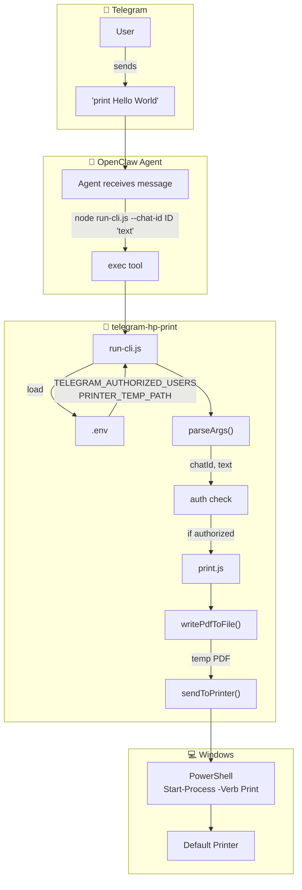

# telegram-hp-print — Flow Chart

## Long polling (simplified)

```
         Phone                 Telegram Servers              OpenClaw
           │                          │                         │
           │  persistent connection    │                         │
           │◄─────────────────────────►│                         │
           │                          │                         │
           │  "print X"                │  getUpdates (long poll)  │
           │─────────────────────────►│◄────────────────────────│
           │                          │                         │
           │                          │  response with update    │
           │                          │─────────────────────────►│
     L      │                          │                         │
           │                          │  getUpdates (again)      │
           │                          │◄────────────────────────│
           │                          │  ...repeat...            │
```

## Skill flow

```
                    ┌─────────────────┐
                    │  Telegram      │
                    │  User          │
                    │  "print X"     │
                    └────────┬───────┘
                             │
                             ▼
                    ┌─────────────────┐
                    │  OpenClaw       │
                    │  Agent (exec)   │
                    └────────┬───────┘
                             │ node run-cli.js --chat-id ID "X"
                             ▼
    ┌────────────────────────────────────────────────────────────┐
    │  run-cli.js                                                │
    │  ┌──────────┐  parseArgs  ┌──────────┐  auth   ┌────────┐│
    │  │ .env     │─────────────►│ chatId,  │────────►│ print  ││
    │  │ TELEGRAM_│              │ text     │  OK     │ .js    ││
    │  │ AUTHORIZED│             └──────────┘         └────┬───┘│
    │  │ PRINTER_  │                                       │    │
    │  │ TEMP_PATH │                                       │    │
    │  └──────────┘                                       │    │
    └─────────────────────────────────────────────────────┼────┘
                                                         │
                                                         ▼
    ┌────────────────────────────────────────────────────────────┐
    │  print.js                                                  │
    │  writePdfToFile(text) ──► temp.pdf ──► sendToPrinter()     │
    │                                    │                       │
    │                                    ▼                       │
    │                          PowerShell -Verb Print            │
    └────────────────────────────────────┬──────────────────────┘
                                         │
                                         ▼
                                ┌─────────────────┐
                                │ Default Printer │
                                └─────────────────┘
```




## Sequence

1. **User** types `print Hello World` in Telegram
2. **OpenClaw** agent matches trigger, runs `exec`: `node skills/telegram-hp-print/run-cli.js --chat-id <SENDER_ID> "Hello World"`
3. **run-cli.js** loads `.env`, parses `--chat-id` and text
4. **Auth**: checks if `chatId` is in `TELEGRAM_AUTHORIZED_USERS`
5. **print.js**: generates PDF (PDFKit) → temp file
6. **print.js**: runs PowerShell `Start-Process -FilePath 'path' -Verb Print`
7. **Windows** sends PDF to default printer
8. Temp PDF is deleted after 10s

## Files


| File       | Role                                         |
| ---------- | -------------------------------------------- |
| run-cli.js | CLI entry, auth, orchestration               |
| print.js   | PDF creation, Windows print                  |
| .env       | TELEGRAM_AUTHORIZED_USERS, PRINTER_TEMP_PATH |


